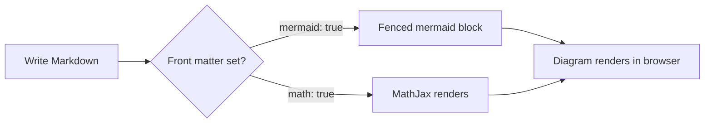
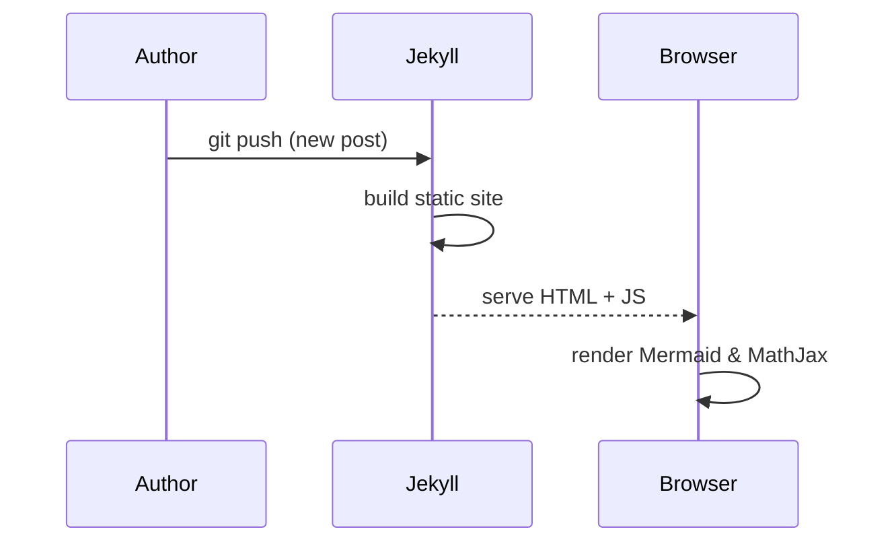

This post is a working reference for the [Chirpy](https://github.com/cotes2020/jekyll-theme-chirpy) theme's Markdown extensions — the prompt boxes, Mermaid diagrams, MathJax, code blocks, tables, footnotes — plus a section at the end on citation management if you want to write posts in a more scientific-article style.

## Prompt Boxes

Chirpy ships with five prompt types. Each is written as a Markdown blockquote with a `{: .prompt-XXX }` class attached on the line right after it.

> This is a **tip**. Use it for shortcuts or best practices.
{: .prompt-tip }

> This is **info**. Use it for neutral, supplementary context.
{: .prompt-info }

> This is a **warning**. Use it when something could go wrong.
{: .prompt-warning }

> This is **danger**. Use it for destructive or irreversible actions.
{: .prompt-danger }

The Markdown source for the warning box above looks like this:

```markdown
> This is a **warning**. Use it when something could go wrong.
{: .prompt-warning }
```

## Mermaid Diagrams

Set `mermaid: true` in the front matter, then fence a code block with `mermaid` as the language.



Sequence diagrams work too:



## MathJax

With `math: true` in the front matter, both inline and block math render via MathJax.

Inline math uses single dollar signs, like the mass–energy relation $E = mc^2$, or the definition of a derivative $f'(x) = \lim_{h \to 0} \frac{f(x+h)-f(x)}{h}$.

Block math uses double dollar signs:

$$
\nabla \cdot \mathbf{E} = \frac{\rho}{\varepsilon_0}, \qquad
\nabla \times \mathbf{B} - \frac{1}{c^2}\frac{\partial \mathbf{E}}{\partial t} = \mu_0 \mathbf{J}
$$

You can also number and reference equations with `\tag{}`:

$$
a^2 + b^2 = c^2 \tag{1}
$$

Equation (1) is the Pythagorean theorem.

## Code Blocks

Fenced code blocks get syntax highlighting and an optional filename header.

```python
# _config.yml snippet
def enable_features(config: dict) -> dict:
    config["math"] = True
    config["mermaid"] = True
    return config
```
{: file="scripts/enable_features.py" }

Inline code uses backticks, like `bundle exec jekyll serve`.

## Tables

| Feature   | Front matter key | Requires plugin? |
|-----------|:-----------------:|:-----------------:|
| Mermaid   | `mermaid: true`    | No                 |
| MathJax   | `math: true`       | No                 |
| TOC       | `toc: true`        | No                 |
| Citations | —                  | Yes (jekyll-scholar) |

## Images with Captions

```markdown

_The Jekyll build pipeline, from Markdown to static HTML_
```

## Footnotes

Chirpy supports standard Markdown footnotes, which is the simplest way to add citation-like references without a plugin.[^kramdown] They render as numbered superscripts with a linked footer list.[^chirpy-docs]

---

## Citation Management for Scientific-Style Posts

If you want a post to read like a paper — in-text citations such as `(Smith et al., 2023)` and a numbered or alphabetized **References** section — you have three practical options, in order of how much setup they need.

### Option 1: Manual footnotes (zero setup)

Chirpy's Markdown engine (kramdown) supports footnotes out of the box, so you can fake citations with no plugin:

```markdown
Diffusion models produce high-fidelity samples.[^ho2020]

[^ho2020]: Ho, J., Jain, A., & Abbeel, P. (2020). *Denoising Diffusion Probabilistic Models*. NeurIPS.
```

This is fine for a handful of references but doesn't give you automatic sorting, deduplication, or citation styles (APA/IEEE/etc.).

> Manual footnotes work anywhere, including GitHub Pages' default build, since kramdown footnotes aren't a custom plugin.
{: .prompt-tip }

### Option 2: jekyll-scholar (BibTeX-based, real citation management)

[jekyll-scholar](https://github.com/inukshuk/jekyll-scholar) is the standard way to get proper scientific citations in Jekyll. It reads a `.bib` file and gives you Liquid tags for in-text citations and a formatted bibliography.

**1. Add the gem** to your `Gemfile`:

```ruby
gem "jekyll-scholar"
```

**2. Enable it** in `_config.yml`:


```yaml
plugins:
  - jekyll-scholar

scholar:
  style: apa
  locale: en
  source: ./_bibliography
  bibliography: references.bib
  bibliography_template: "{{reference}}"
```


**3. Create `_bibliography/references.bib`:**

```bibtex
@article{ho2020denoising,
  title   = {Denoising Diffusion Probabilistic Models},
  author  = {Ho, Jonathan and Jain, Ajay and Abbeel, Pieter},
  journal = {Advances in Neural Information Processing Systems},
  year    = {2020}
}
```

**4. Cite in-post** with the `cite` Liquid tag (shown here inside `raw` so this demo post itself doesn't try to execute it):


```liquid
Diffusion models learn to reverse a gradual noising process .
```

here's an example of the citation 

**5. Print the bibliography** wherever you want the references section:


```liquid
## References

```


`--cited` only lists sources actually cited in the post; drop it to print the whole `.bib` file.

> jekyll-scholar is **not** on GitHub Pages' whitelist of safe plugins, so `github-pages` won't build it for you automatically. You'll need to either build the site yourself and push the generated `_site/` output, or use a GitHub Actions workflow that runs `bundle exec jekyll build` and deploys the result. Chirpy's own repo already ships a GitHub Actions deploy workflow you can adapt.
{: .prompt-warning }

### Option 3: Citation.js or a reference manager export (no Ruby plugin)

If you can't add gems (e.g. locked-down hosting), export citations as formatted text from Zotero/EndNote/BibTeX and paste them as a manual References section, then hand-link each in-text mention to its footnote anchor as in Option 1. This gets you the visual result of Option 2 without touching `_config.yml`, at the cost of doing the formatting yourself.

### Quick comparison

| | Setup effort | Auto-formatting | Works on default GitHub Pages build |
|---|:---:|:---:|:---:|
| Footnotes | None | No | Yes |
| jekyll-scholar | Moderate (Gemfile + Actions) | Yes (APA/IEEE/etc.) | No — needs custom build |
| Manual + reference manager export | Low | Partial (you paste pre-formatted text) | Yes |

For a single scientific-style post, footnotes are usually enough. For a blog that regularly cites papers, jekyll-scholar is worth the one-time GitHub Actions setup.

## Bibs

---

[^kramdown]: kramdown is the Markdown converter Chirpy uses by default; it implements footnotes as part of the Kramdown spec, not as a Chirpy-specific feature.
[^chirpy-docs]: See the [Chirpy writing guide](https://chirpy.cotes.page/posts/write-a-new-post/) for the full list of supported Markdown extensions.
